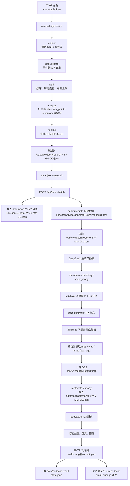
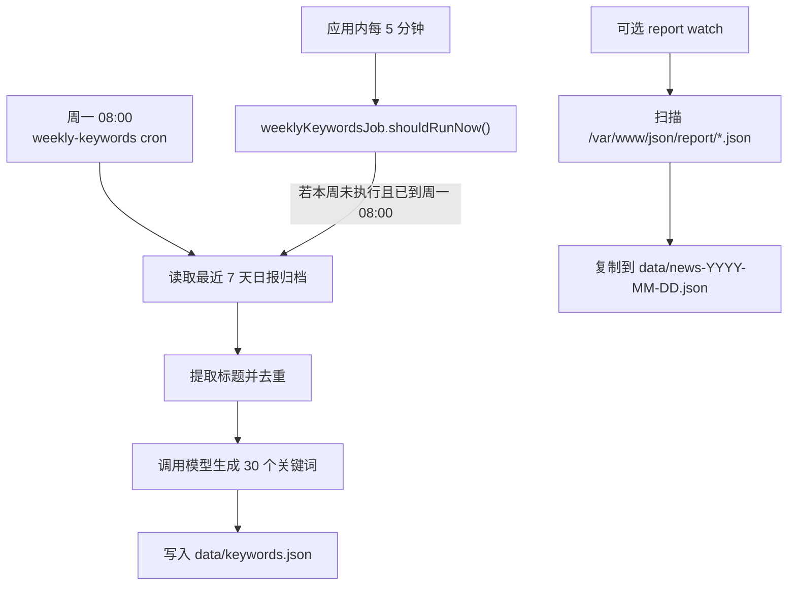

# 定时任务与数据流转总览

更新日期：`2026-04-08`

## 1. 这份文档解决什么问题

这份文档只回答三件事：

1. 这个项目当前有哪些定时任务。
2. 每条任务链路的数据如何一步接一步流转。
3. 每天播客生成完成后，邮件在什么节点发出，以及失败后如何补发。

说明：

- 线上日报主链路以 README 与产品文档中已记录的 `2026-04-08` 实测时间为准。
- 播客与邮件自动化的执行逻辑以当前仓库脚本为准。
- 某些服务器上的真实 cron 表达式不在仓库里固化，变更生产前仍需最终核对 `crontab -l` 与 `systemctl list-timers`。

## 2. 当前定时任务清单

### 2.1 主链路任务

1. 上游日报生成
   - 触发源：`ai-rss-daily.timer`
   - 执行体：`ai-rss-daily.service`
   - 上游项目：`/opt/ai-RSS-person`
   - 产物：`/var/www/json/report/YYYY-MM-DD.json`

2. 日报导入网站
   - 脚本：`/var/www/ai-coming-website/sync-json-news.sh`
   - 作用：把 `/var/www/json/report/YYYY-MM-DD.json` 导入网站接口 `/api/news/batch`
   - 产物：
     - `data/news-YYYY-MM-DD.json`
     - `data/YYYY-MM-DD.json`
     - `reports-archive/YYYY-MM-DD.json`
   - 副作用：导入成功后自动触发官网播客生成

3. 播客邮件即时发送
   - 服务：`server/services/podcast-email.js`
   - 触发点：`server/services/news-podcast.js`
   - 作用：当天播客 metadata 进入 `ready` 后，立即将音频和完整口播稿发送到 `noel.huang@aicoming.cn`

4. 播客邮件补发任务
   - 脚本：`scripts/run-podcast-email-once.js`
   - 包装脚本：`scripts/run-podcast-email-once.sh`
   - 调度方式：推荐通过 cron 周期性补发
   - 作用：当天邮件发送失败时，按状态文件进行重试

### 2.2 历史兼容任务

5. 历史兼容脚本
   - `scripts/run-podcast-autogen-once.js`
   - `scripts/run-wechat-autogen-once.js`
   - 说明：仍保留在仓库中用于历史排障，但不再是正式下游链路，且现在默认 `disabled`

6. 日报复制兼容任务
   - 脚本：`scripts/watch-report-to-data.sh`
   - 作用：把 `/var/www/json/report/*.json` 复制成 `data/news-YYYY-MM-DD.json`
   - 模式：
     - 持续监听模式：默认每 `15` 秒轮询一次
     - 一次性扫描模式：`--once`
   - 说明：这是兼容链路，不是官网播客与邮件发送的正式输入源

7. 每周关键词任务
   - 脚本：`scripts/run-weekly-keywords-once.js`
   - cron 安装脚本：`scripts/setup-weekly-keywords-cron.sh`
   - 默认时间：每周一 `08:00`
   - 输入：最近 7 天日报归档
   - 输出：`data/keywords.json`

8. 运行时内置调度
   - `weeklyKeywordsJob.startScheduler()`：应用启动后每 `5` 分钟检查一次“本周关键词是否到点”
   - `securityRuntime.cleanupExpiredData()`：每 `1` 小时清理一次安全相关过期数据

## 3. 每日主链路流程图

## 4. 2026-04-08 已确认时间线

下面这条时间线里，`07:02:21 -> 07:09:20` 是文档中已确认的实测值；之后播客部分是按当前代码依赖顺序推导出的运行窗口。

| 时间（CST） | 步骤 | 是否已确认 | 说明 |
| --- | --- | --- | --- |
| `07:02:21` | `ai-rss-daily.service` 启动 | 已确认 | 见 `README.md` / `docs/PRODUCT.md` |
| `07:02:22` | collect 开始 | 已确认 | 开始抓源 |
| `07:08:19` | collect 结束 | 已确认 | 收集 `110` 条 |
| `07:08:19 -> 07:08:22` | deduplicate | 已确认 | `110 -> 108` |
| `07:08:22 -> 07:08:24` | rank | 已确认 | 待 AI 总结 `40` 条 |
| `07:08:24 -> 07:09:18` | analyze | 已确认 | AI 成功 `40` |
| `07:09:19 -> 07:09:20` | finalize + publish | 已确认 | 生成正式日报并复制到 `/var/www/json/report` |
| `07:10` 左右 | `sync-json-news.sh` 应开始导入 | 建议窗口 | 仓库未固化 cron 时刻，但这一步应紧跟日报发布 |
| `07:10` 后数秒 | `/api/news/batch` 写入网站数据 | 逻辑已确认 | `sync-json-news.sh` 完成包装后调用导入接口 |
| `07:10` 后数秒 | 自动触发 `generateNewsPodcast(date)` | 逻辑已确认 | `server/routes/news.js` 中 `setImmediate` 触发 |
| `07:10 -> 07:35` | DeepSeek 脚本 + MiniMax TTS + 下载 + OSS | 推导窗口 | 实际耗时取决于模型与音频轮询，需以服务器当天 metadata 为准 |
| 播客 `ready` 后数秒内 | 邮件即时发送 | 代码已确认 | 触发点已挂在 `news-podcast` 成功路径上 |

## 5. 各子链的逐步时间预算

### 5.1 日报链

`2026-04-08` 的日报链已知耗时约 `7` 分钟：

- `collect`：约 `5分57秒`
- `deduplicate`：约 `3秒`
- `rank`：约 `2秒`
- `analyze`：约 `54秒`
- `finalize + publish`：约 `1秒`

结论：

- 日报并不晚。
- 正式日报在 `07:09:20` 前后已经进入 `/var/www/json/report`。

### 5.2 播客链

播客链的固定步骤如下：

1. 读取 `/var/www/json/report/YYYY-MM-DD.json`
2. 调 DeepSeek 生成口播稿
3. 写入 `pending / script_ready`
4. 调 MiniMax 创建异步 TTS 任务
5. 轮询 MiniMax 状态
6. 根据 `file_id` 下载音频或 tar 归档
7. 解包提取音频
8. 上传 OSS
9. 写回 `data/podcasts/news/YYYY-MM-DD.json` 为 `ready`

时间风险主要在两处：

- DeepSeek 重试：`PODCAST_SCRIPT_MAX_RETRIES=3`
- MiniMax 超时：`MINIMAX_TTS_TIMEOUT_MS=600000`

### 5.3 邮件发送链

1. 读取当天 `data/podcasts/news/YYYY-MM-DD.json`
2. 要求 `status === ready`
3. 组装标题、摘要、完整口播稿
4. 优先附加音频附件
5. 如果附件下载失败，正文保留音频链接
6. 通过 SMTP 发送到 `noel.huang@aicoming.cn`
7. 写入 `data/podcast-email-state.json`

## 6. 当前时间结论

当前正式下游已经不再依赖旧的 `09:05` 微信扫描窗口。

现在的关键节点变成：

- `07:09:20` 左右：日报进入 `/var/www/json/report`
- 紧接着：官网播客开始生成
- 播客 `ready` 后：立即触发邮件发送

也就是说，邮件时间直接跟随官网播客生成完成时间，而不是再额外等待固定窗口。

## 7. 旁路任务时间图

## 8. 当前最值得立刻改的点

1. 确保服务器 SMTP 配置完整。
2. 安装 `podcast-email` 补发 cron。
3. 从服务器 `crontab` 中移除旧的 `podcast-autogen` 与 `wechat-autogen` 任务。
4. `sync-json-news.sh` 文件头里“每天 9:05 自动同步最新新闻”的注释已经过时，容易误导。
5. 每周关键词当前既支持应用内 5 分钟检查，也支持外部 cron；虽有 `last_success_week` 去重，但运维上最好明确只保留一种主调度方式。

## 9. 我建议你下一步怎么做

1. 确认服务器 SMTP 能正常发信。
2. 安装 `podcast-email` 补发 cron。
3. 从服务器移除旧的 `podcast-autogen` 与 `wechat-autogen` cron。
4. 最后到服务器核一次真实 `crontab` 与 `systemd timer`
