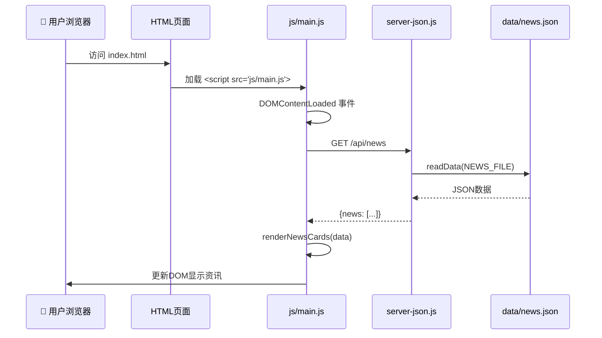
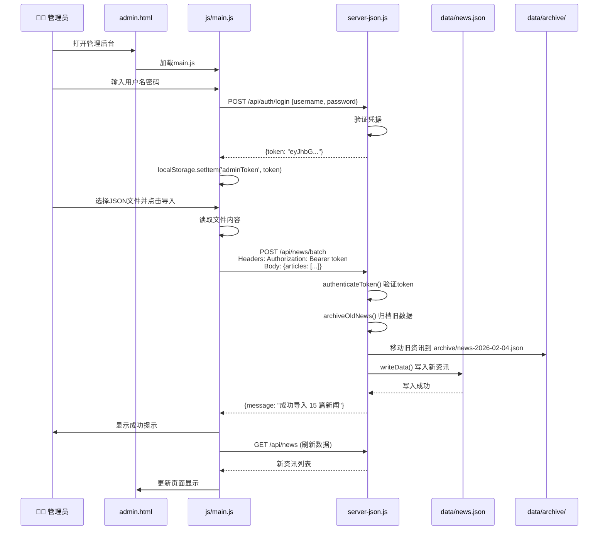
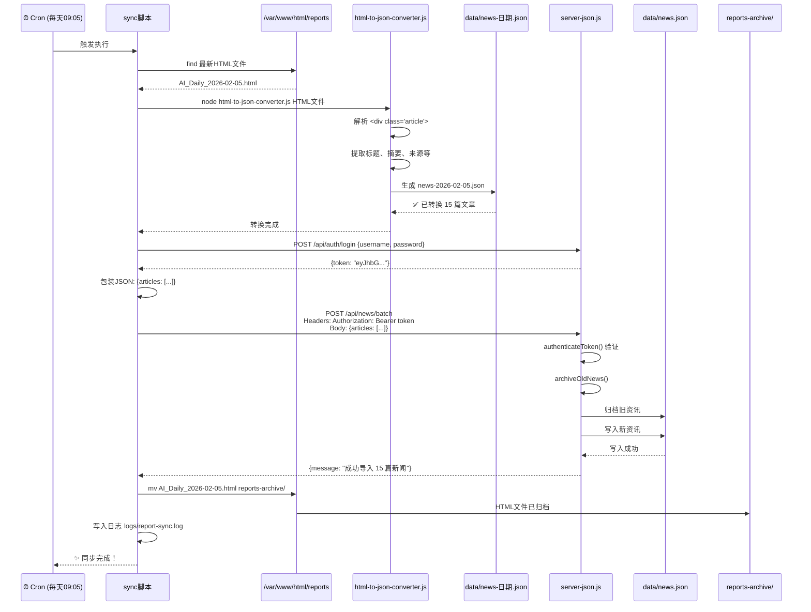
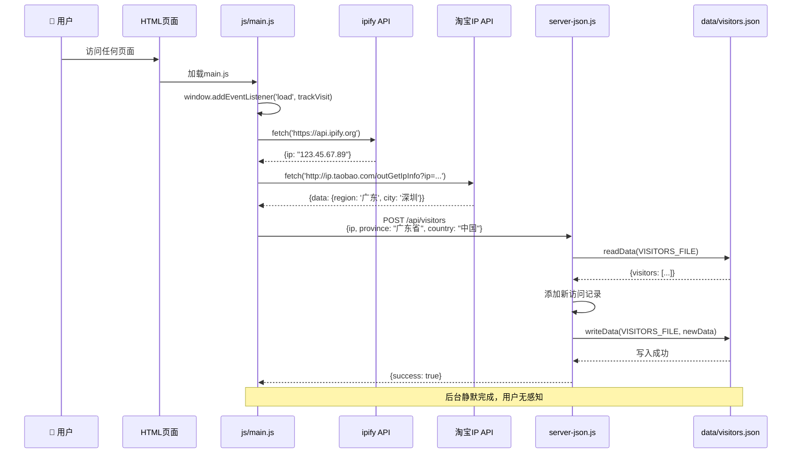
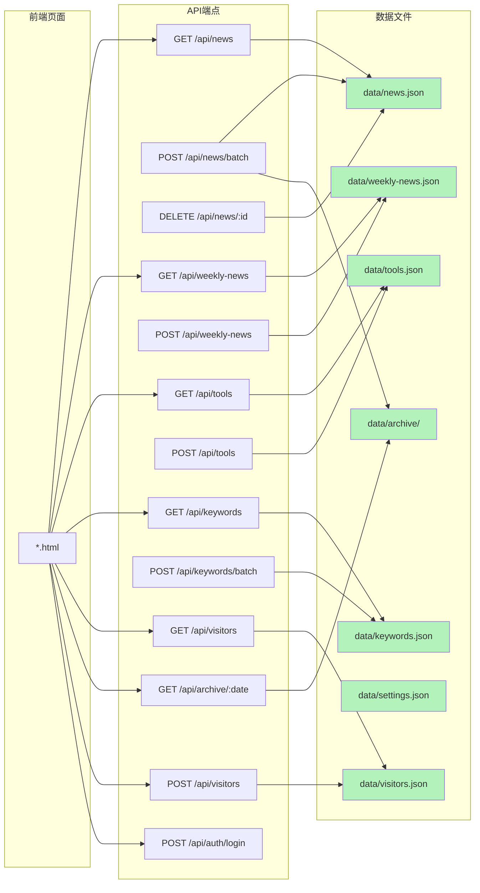
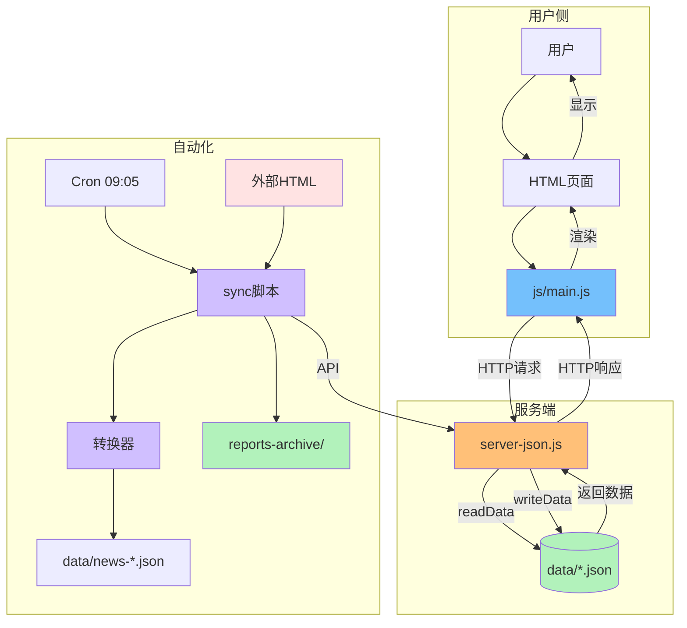

# AI资讯网站 - 文件交互流程图

## 整体架构总览

```mermaid
graph TB
    User[👤 用户] -->|访问| HTML[HTML页面层]
    HTML -->|加载| MainJS[js/main.js]
    MainJS -->|API调用| Server[server-json.js]
    Server -->|读写| Data[(数据文件层)]
    Server -->|归档| Archive[archive/目录]

    ExtHTML[📄 外部日报HTML] -->|上传| Reports[/var/www/html/reports]
    Reports -->|定时读取| Sync[历史同步执行脚本（已删除）]
    Sync -->|调用| Converter[html-to-json-converter.js]
    Converter -->|生成| TempJSON[data/news-日期.json]
    Sync -->|API导入| Server
    Sync -->|归档| ReportsArchive[reports-archive/]

    Cron[Cron 09:05] -->|触发| Sync

    style HTML fill:#e3f2fd
    style MainJS fill:#74c0fc
    style Server fill:#ffc078
    style Data fill:#b2f2bb
    style Archive fill:#b2f2bb
    style Sync fill:#d0bfff
    style Converter fill:#d0bfff
    style Cron fill:#f8f0fc
    style Reports fill:#ffe3e3
    style ReportsArchive fill:#b2f2bb
```

## 1. 用户访问流程



**涉及文件**:
- `index.html` - 主页入口
- `js/main.js` - 前端逻辑
- `server-json.js` - 后端API
- `data/news.json` - 数据文件

---

## 2. 管理员导入资讯流程



**涉及文件**:
- `admin.html` - 管理界面
- `js/main.js` - 前端逻辑 (login函数, importNews函数)
- `server-json.js` - API端点 `/api/auth/login`, `/api/news/batch`
- `data/news.json` - 今日资讯
- `data/archive/` - 历史归档

---

## 3. 日报自动同步流程 (完整)



**涉及文件**:
- `历史同步执行脚本（已删除）` - 同步脚本
- `历史同步设置脚本（已删除）` - 设置cron
- `scripts/html-to-json-converter.js` - HTML转换器
- `/var/www/html/reports/AI_Daily_*.html` - 源HTML文件
- `data/news-*.json` - 转换后的临时JSON
- `server-json.js` - API服务器
- `data/news.json` - 目标数据文件
- `reports-archive/` - 已处理HTML归档
- `logs/report-sync.log` - 同步日志

---

## 4. 访客追踪流程



**涉及文件**:
- `js/main.js` - trackVisit函数
- `server-json.js` - `/api/visitors` 端点
- `data/visitors.json` - 访客记录
- 外部API: ipify.org, ip.taobao.com

---

## 5. 文件依赖关系图

```mermaid
graph TD
    %% 前端HTML
    index[index.html] -->|加载| main[js/main.js]
    news[news.html] -->|加载| main
    admin[admin.html] -->|加载| main
    weekly[weekly.html] -->|加载| main
    tools[tools.html] -->|加载| main
    keywords[keywords.html] -->|加载| main
    visitors[visitors.html] -->|加载| main
    archive[archive.html] -->|加载| main

    %% main.js依赖
    main -->|API调用| server[server-json.js]

    %% server-json.js依赖
    server -->|读取/写入| news_data[data/news.json]
    server -->|读取/写入| weekly[data/weekly-news.json]
    server -->|读取/写入| tools[data/tools.json]
    server -->|读取/写入| keywords[data/keywords.json]
    server -->|读取/写入| visitors[data/visitors.json]
    server -->|读取/写入| settings[data/settings.json]
    server -->|归档| archive_dir[data/archive/]

    %% 自动化脚本依赖
    sync[历史同步执行脚本（已删除）] -->|调用| converter[html-to-json-converter.js]
    sync -->|API调用| server
    sync -->|读取| reports[/var/www/html/reports]
    sync -->|归档| reports_archive[reports-archive/]
    converter -->|生成| temp_json[data/news-*.json]
    converter -->|读取| reports

    setup[历史同步设置脚本（已删除）] -->|配置| cron[cron定时任务]
    cron -->|触发| sync

    %% 配置文件
    server -->|读取| env[.env]
    package[package.json] -->|定义依赖| server

    style main fill:#74c0fc
    style server fill:#ffc078
    style news_data fill:#b2f2bb
    style weekly fill:#b2f2bb
    style tools fill:#b2f2bb
    style keywords fill:#b2f2bb
    style visitors fill:#b2f2bb
    style settings fill:#b2f2bb
    style archive_dir fill:#b2f2bb
    style sync fill:#d0bfff
    style converter fill:#d0bfff
    style cron fill:#f8f0fc
    style reports fill:#ffe3e3
    style reports_archive fill:#b2f2bb
    style env fill:#fff
    style package fill:#fff
```

---

## 6. API端点与文件映射



---

## 7. 目录结构树形图

```
ai-coming-website/
├── 📄 index.html                    # 主页
├── 📄 news.html                     # 日报页面
├── 📄 admin.html                    # 管理后台
├── 📄 weekly.html                   # 每周资讯
├── 📄 tools.html                    # AI工具
├── 📄 keywords.html                 # 关键词云
├── 📄 visitors.html                 # 访客统计
├── 📄 archive.html                  # 历史归档
│
├── 📁 js/
│   └── 📘 main.js (1500行)          # 核心前端逻辑
│
├── 📁 data/
│   ├── 📊 news.json                 # 今日资讯
│   ├── 📊 weekly-news.json          # 每周资讯
│   ├── 📊 tools.json                # AI工具
│   ├── 📊 keywords.json             # 关键词
│   ├── 📊 visitors.json             # 访客记录
│   ├── 📊 settings.json             # 系统设置
│   └── 📁 archive/                  # 历史归档
│       ├── news-2026-02-04.json
│       ├── news-2026-02-03.json
│       └── ...
│
├── 📁 scripts/
│   └── 📘 html-to-json-converter.js # HTML转JSON转换器
│
├── 📁 reports-archive/              # 已处理的HTML归档
│   ├── AI_Daily_2026-02-05.html
│   └── ...
│
├── 📁 logs/
│   └── 📝 report-sync.log           # 同步日志
│
├── 🚀 server-json.js (2022行)       # 主服务器
├── 🔄 历史同步执行脚本（已删除）    # 日报同步脚本
├── ⚙️ 历史同步设置脚本（已删除）          # 同步设置脚本
├── ⚙️ .env                          # 环境变量
├── 📦 package.json                  # 依赖配置
└── 📘 CLAUDE.md                     # 项目文档
```

---

## 8. 数据流向总览



---

## 总结：核心文件与交互

### 🎯 三大核心文件

| 文件 | 行数 | 作用 | 交互对象 |
|------|------|------|---------|
| **js/main.js** | 1500 | 前端逻辑控制器 | 所有HTML页面 + API |
| **server-json.js** | 2022 | 后端API服务器 | main.js + data/*.json |
| **历史同步执行脚本（已删除）** | ~114 | 自动同步脚本 | 转换器 + API + 文件系统 |

### 📊 数据文件清单 (6个JSON + 1个目录)

```
data/
├── news.json          # 今日资讯 (15篇)
├── weekly-news.json   # 每周资讯
├── tools.json         # AI工具库
├── keywords.json      # 关键词云
├── visitors.json      # 访客记录
├── settings.json      # 系统设置
└── archive/           # 历史归档
```

### 🔄 三大核心流程

1. **用户访问**: HTML → main.js → API → server → JSON → 返回 → 渲染
2. **管理员操作**: admin.html → main.js → JWT认证 → API → server → 写入JSON
3. **自动同步**: Cron → sync脚本 → 转换器 → API → server → 写入JSON → 归档

### 📝 关键点

- **所有HTML页面都加载 `js/main.js`**
- **main.js 通过API与 server-json.js 通信**
- **server-json.js 读写所有 data/*.json 文件**
- **自动化脚本独立运行，通过API与服务器交互**
- **JWT token用于管理员操作认证**
- **旧数据自动归档到 archive/ 目录**
