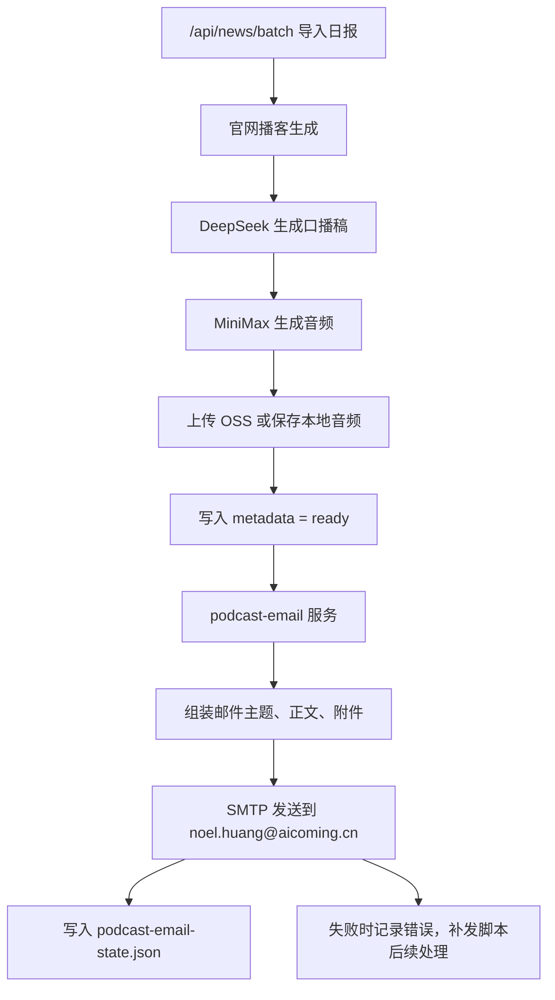

# 官网播客生成后自动发送邮件设计

日期：`2026-04-08`

## 1. 背景

当前每日链路里，日报导入网站后会自动触发官网播客生成。官网播客生成完成后，系统原本还保留两条后续自动化：

1. `scripts/run-podcast-autogen-once.js`
   - 作为“播客自动补偿扫描”
2. `scripts/run-wechat-autogen-once.js`
   - 作为“微信公众号自动任务”

本次需求要求：

- 不再把以上两条自动任务作为正式链路
- 改为在“官网播客真正生成完成后”，自动把：
  - 播客音频
  - 完整口播稿
  发送到指定邮箱 `noel.huang@aicoming.cn`

## 2. 目标

### 2.1 功能目标

当某天播客 metadata 进入 `ready` 状态后，系统应立即向 `noel.huang@aicoming.cn` 发送一封邮件，包含：

- 播客标题与日期
- 摘要
- 完整口播稿
- 音频附件
- 音频兜底链接

### 2.2 系统目标

- 不影响官网播客生成成功
- 不因邮件失败而回滚播客 `ready`
- 对同一条播客避免重复发送
- 支持失败后补发

## 3. 非目标

- 不再继续扩展微信公众号自动发布能力
- 不把邮件发送耦合到微信草稿、语音群发或其他下游渠道
- 不改动日报生成上游项目 `/opt/ai-RSS-person`
- 不把邮件发送变成新的“播客生成器”；播客仍由现有官网链路生成

## 4. 当前链路与目标链路

### 4.1 当前链路

```text
日报 JSON
-> /api/news/batch
-> 自动触发官网播客生成
-> metadata ready
-> 旧的补偿扫描 / 微信自动任务
```

### 4.2 目标链路

```text
日报 JSON
-> /api/news/batch
-> 自动触发官网播客生成
-> metadata ready
-> 立即发送邮件到 noel.huang@aicoming.cn
-> 若失败，记录状态，等待补发脚本
```

## 5. 方案选择

### 5.1 候选方案

#### 方案 A：在播客 ready 时即时发送

在 `server/services/news-podcast.js` 中，当当天 metadata 写成 `ready` 后，立即调用邮件服务发送。

优点：

- 最符合“官网播客生成之后就可以开始发送邮箱”
- 没有额外轮询延迟
- 触发时机最准确

缺点：

- 需要明确处理“邮件发送失败但播客已 ready”的状态分离

#### 方案 B：新增独立扫描式邮件任务

新增一个 `run-podcast-email-once.js`，定时扫描当天 `ready` 的播客 metadata 并发送邮件。

优点：

- 与旧自动任务风格一致

缺点：

- 不是即时发送
- 本质仍是轮询

### 5.2 选择结论

本次采用方案 A 作为正式主链路，并保留一个轻量补发脚本作为兜底，而不是继续把扫描脚本当作正式发送入口。

## 6. 设计总览



## 7. 模块设计

### 7.1 `server/services/email-sender.js`

职责：

- 抽象 SMTP 发送能力
- 不感知播客业务
- 提供统一接口，例如：

```js
sendEmail({
  to,
  subject,
  text,
  html,
  attachments
})
```

要求：

- 基于 SMTP 配置
- 能发送纯文本或 HTML
- 支持附件
- 错误信息要保留原始上下文，便于排查

### 7.2 `server/services/podcast-email.js`

职责：

- 读取当天播客 metadata
- 生成邮件主题、正文和附件
- 负责防重与状态写入

输入：

- `date`
- `metadata`
- 可选本地音频路径
- 可选站点公网地址

输出：

- 邮件发送结果
- 状态文件更新结果

### 7.3 `scripts/run-podcast-email-once.js`

职责：

- 仅作为补发脚本
- 扫描当天播客 metadata
- 如果：
  - metadata 已 `ready`
  - 邮件未成功发送
  - 或发送指纹发生变化
  则再次尝试发送

注意：

- 这个脚本不是正式主触发点
- 它只做失败补发和手工重试

## 8. 触发时机设计

正式触发点放在 `server/services/news-podcast.js` 内部。

当前播客服务在以下时机写入最终成功态：

1. DeepSeek 口播稿已生成
2. MiniMax 音频已完成
3. 音频已上传 OSS 或落盘本地
4. `readyMetadata` 已构造完成
5. metadata 已写回磁盘

本设计要求：

- 在“metadata 成功写回 `ready` 之后”触发邮件发送

原因：

- 保证官网已经具备可用播客
- 保证邮件拿到的是最终版本
- 避免发送中间态或未完成数据

## 9. 邮件内容设计

### 9.1 收件人

- 固定：`noel.huang@aicoming.cn`

### 9.2 邮件主题

建议格式：

```text
[AIcoming播客] YYYY-MM-DD AI资讯日报播客
```

### 9.3 邮件正文

正文包含：

1. 日期
2. 标题
3. 摘要
4. 完整口播稿
5. 官网或 OSS 音频链接

### 9.4 附件策略

优先级如下：

1. 本地音频存在时，直接附本地文件
2. 若 metadata 指向 OSS 音频，则尝试先下载后作为附件
3. 若下载失败，则至少在正文中保留 `audio_url`

这样可以保证：

- 最理想情况是“邮箱里直接有音频附件”
- 最差情况也还有可点击的音频地址

## 10. 状态与防重

新增状态文件：

- `data/podcast-email-state.json`

建议结构：

```json
{
  "last_attempt_at": "",
  "last_attempt_date": "",
  "last_success_at": "",
  "last_success_date": "",
  "last_error": null,
  "last_fingerprint": "",
  "last_audio_url": "",
  "last_generation_signature": "",
  "last_recipient": "noel.huang@aicoming.cn"
}
```

### 10.1 指纹规则

同一封播客邮件的防重指纹建议由以下字段组成：

- `date`
- `generation_signature`
- `audio_url`
- `script_hash`
- `recipient`

### 10.2 行为规则

- 如果当前指纹与上次成功发送一致，则跳过
- 如果播客重新生成导致指纹变化，则允许再次发送
- 如果上次发送失败，则允许补发

## 11. 失败处理

### 11.1 核心原则

邮件发送失败不能让官网播客回到失败状态。

### 11.2 具体行为

如果播客已 `ready`，但邮件发送失败：

- 官网播客仍保持 `ready`
- `podcast-email-state.json` 记录失败原因
- 日志记录错误
- 可通过补发脚本重试

### 11.3 失败类型

需要覆盖：

- SMTP 配置缺失
- SMTP 登录失败
- 附件读取失败
- OSS 音频下载失败
- 状态文件写入失败

## 12. 旧自动任务的处理方式

以下两个旧自动任务不再作为正式链路：

- `scripts/run-podcast-autogen-once.js`
- `scripts/run-wechat-autogen-once.js`

处理原则：

- 不立即删除文件
- 从文档和主流程中移除
- 在 `package.json` 中保留脚本但标记为 deprecated 或停止安装 cron

这样做的原因是：

- 回滚成本低
- 历史排障时仍可参考旧实现

## 13. 配置设计

在 `.env.example` 中新增：

```text
PODCAST_EMAIL_ENABLED=true
PODCAST_EMAIL_TO=noel.huang@aicoming.cn
PODCAST_EMAIL_STATE_FILE=./data/podcast-email-state.json

SMTP_HOST=
SMTP_PORT=
SMTP_SECURE=
SMTP_USER=
SMTP_PASS=
SMTP_FROM=
```

说明：

- 默认收件人仍允许配置覆盖，但当前正式目标是 `noel.huang@aicoming.cn`
- 不把邮件配置复用到微信或其他下游渠道

## 14. 测试设计

### 14.1 新增测试

- `tests/email-sender.test.mjs`
- `tests/podcast-email.test.mjs`

### 14.2 更新测试

- `tests/news-podcast.test.mjs`

### 14.3 覆盖场景

必须覆盖：

1. 播客 `ready` 后立即触发邮件发送
2. 同一指纹不重复发送
3. 指纹变化后允许重发
4. 邮件发送失败不影响播客 `ready`
5. 补发脚本能在失败后重新发送
6. 附件不可用时仍保留链接兜底

## 15. 发布与迁移

迁移顺序：

1. 增加邮件发送能力
2. 在播客 `ready` 后接入邮件发送
3. 增加补发脚本
4. 停用旧的 podcast autogen / wechat autogen cron
5. 更新文档

## 16. 结论

正式方案采用“官网播客 ready 后即时发送邮件 + 独立补发脚本”的模式。

这能满足：

- 更贴近真实业务目标
- 去掉微信自动任务和播客补偿扫描的主流程地位
- 让邮件成为官网播客完成后的直接下游动作
- 失败时不破坏官网播客本身
